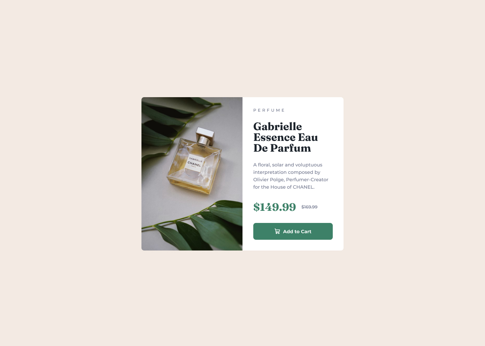

# Frontend Mentor — Решение задачи «Карточка превью продукта»

Это моё решение задачи [«Product preview card component» на Frontend Mentor](https://www.frontendmentor.io/challenges/product-preview-card-component-GO7UmttRfa). Задачи Frontend Mentor помогают прокачивать навыки вёрстки на реальных проектах.

## Содержание

- [Обзор](#обзор)
  - [Задача](#задача)
  - [Скриншот](#скриншот)
  - [Ссылки](#ссылки)
- [Процесс работы](#процесс-работы)
  - [Стек технологий](#стек-технологий)
  - [Чему я научился](#чему-я-научился)

## Обзор

### Задача

Пользователи должны иметь возможность:

- Видеть оптимальный макет в зависимости от размера экрана устройства
- Наблюдать состояния hover и focus на интерактивных элементах

### Скриншот

### Ссылки

- URL живого сайта: [Ссылка на живой сайт](https://vimanshin.github.io/product-preview-card-component-main/)

## Процесс работы

### Стек технологий

- Семантическая разметка HTML5 (`main`, `article`, `picture`, `button`)
- SCSS (Sass) — модульная структура 7-1, `@use`, partials
- CSS3 — Flexbox, mobile-first медиа-запросы
- Локальные шрифты через `@font-face` (woff2)
- Адаптивные изображения — `<picture>` + `srcset`
- Сборка стилей — npm + Dart Sass (`sass:watch` / `sass:build`)
- Доступность (a11y) — `alt`, `aria-hidden`, `:focus-visible`, `@media (hover: hover)`
- Методология имён — BEM (`.card`, `.card__title`, …)

### Чему я научился

- **Организовывать стили через SCSS** — разнести код по папкам (`abstracts`, `base`, `components`) и собирать всё в одном `main.scss`, чтобы проект было проще поддерживать.
- **Работать mobile-first** — сначала вёрстка под узкий экран, затем расширение через `@include respond($bp-tablet)` без переписывания всей вёрстки.
- **Собирать адаптивную карточку на Flexbox** — колонка на mobile и ряд на tablet+, плюс `flex-shrink: 0` для блока с фото, чтобы картинка не «сплющивалась».
- **Подключать разные изображения под ширину экрана** — через `<picture>` и `srcset`, чтобы на телефоне грузился более лёгкий mobile-кадр.
- **Подключать шрифты локально** — `@font-face`, `font-display: swap` и пути относительно скомпилированного `css/style.css`.
- **Делать интерактив доступным** — кнопка как `<button>`, видимый `:focus-visible` для клавиатуры, hover только для устройств с мышью (`@media (hover: hover)`).
- **Настроить рабочий процесс в Cursor** — `npm run sass:watch` во время разработки и `npm run sass:build` перед публикацией на GitHub Pages.